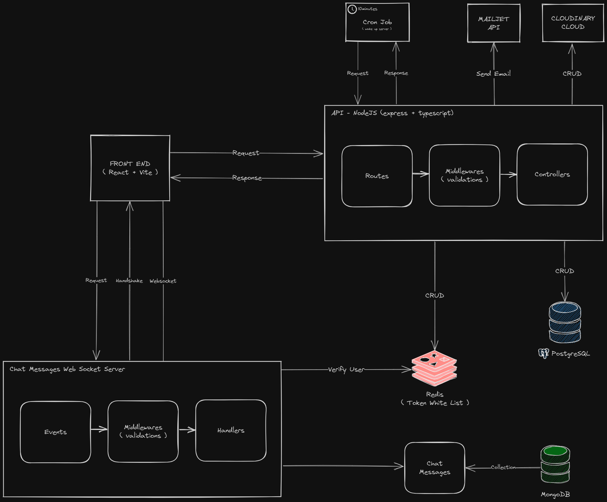

<!-- PROJECT LOGO -->
 

    

  <h3 align="center">Only Foods - Documentation</h3>

  

    All the documentation of the Only Foods Project can be found in this repository.
     
    <a href="https://onlyfoods.netlify.app/">View Demo</a>
    ·
    <a href="https://github.com/TiagoRibeiro25/Only-Foods-FE">Frontend Repo</a>
    ·
    <a href="https://github.com/TiagoRibeiro25/Only-Foods-BE">Backend Repo</a>
  

<!-- Table of Contents -->
 

  
Table of Contents

  <ol>
    <li>
      <a href="#http-requests-and-responses">
        HTTP Requests and Responses
      </a>
    </li>
    <li>
      <a href="#architecture">
        Architecture
      </a>
    </li>
    <li>
      <a href="#data-model">
        Data Model
      </a>
    </li>
    <li>
      <a href="#contact">
        Contact
      </a>
    </li>
  </ol>

<!-- HTTP Requests and Responses -->
## HTTP Requests and Responses

[Online Only Foods API Postman Documentation][postman-docs]

<!-- ARCHITECTURE -->
## Architecture

<!-- DATA MODEL -->
## Data Model

<!-- CONTACT -->
## Contact

Contact section of my personal website:
[tiagoribeiro.tech](https://tiagoribeiro.tech/)

<!-- MARKDOWN LINKS & IMAGES -->
[postman-docs]: https://documenter.getpostman.com/view/25229849/2s946k5q27
